# Claude Code 完全Book

> AIエージェントの構造・設計・運用を、原則から実装まで一気通貫で解き明かす。
> ―― 0425・0426 セミナー＋8本の録音文字起こしを基に再構成。


---

## 目次

- [まえがき](#まえがき)
- [第1部：原則編](#第1部原則編)
  - [第1章 AIの基礎は「言葉 × 設計」だけ](#第1章-aiの基礎は言葉--設計だけ)
  - [第2章 AIエージェント ＝ 人間の構造](#第2章-aiエージェント--人間の構造)
- [第2部：仕組み編](#第2部仕組み編)
  - [第3章 Agentic Loop とオーケストレーション](#第3章-agentic-loop-とオーケストレーション)
  - [第4章 LLM の使い分け](#第4章-llm-の使い分け)
  - [第5章 ツール と スキル](#第5章-ツール-と-スキル)
- [第3部：記憶編](#第3部記憶編)
  - [第6章 メモリ設計の基本](#第6章-メモリ設計の基本)
  - [第7章 RAG の実装](#第7章-rag-の実装)
  - [第8章 ベクトル空間とセマンティック検索](#第8章-ベクトル空間とセマンティック検索)
- [第4部：ループ編](#第4部ループ編)
  - [第9章 Loop の 4 階層](#第9章-loop-の-4-階層)
  - [第10章 プロンプト設計の型](#第10章-プロンプト設計の型)
  - [第11章 エラー対応と Rate Limit](#第11章-エラー対応と-rate-limit)
- [第5部：組織編](#第5部組織編)
  - [第12章 AI 駆動型組織の作り方](#第12章-ai-駆動型組織の作り方)
  - [第13章 採用・配置・KPI 委譲](#第13章-採用配置kpi-委譲)
  - [第14章 人間 vs AIエージェント](#第14章-人間-vs-aiエージェント)
- [第6部：実装編](#第6部実装編)
  - [第15章 Claude Code 5段パイプライン](#第15章-claude-code-5段パイプライン)
  - [第16章 開発環境・CLI・MCP](#第16章-開発環境cli-mcp)
  - [第17章 2日間ワークショップで何をやったか](#第17章-2日間ワークショップで何をやったか)
- [エピローグ：Loop を閉じる](#エピローグloop-を閉じる)
- [付録 A：実装チェックリスト](#付録-a実装チェックリスト)
- [付録 B：用語集](#付録-b用語集)
- [付録 C：名言集](#付録-c名言集)

---

## まえがき

本書は2026年4月25日・26日に行われた **「AIエージェントの構造と設計」セミナー**（登壇：石田文太／株式会社X代表＝ぶんたさん）の現場メモ・レポート・録音文字起こし8本を素材に、Claude Code を中核としたAIエージェント開発の **原則／仕組み／記憶／ループ／組織／実装** を6部構成で再構成したものである。

セミナーを貫く2つの柱を最初に置いておく。

> **AI ＝ 言葉（データ）× 設計（戦略）**
> **動かないときは、必ずこの2つのどちらかが破綻している。**

そして本書のゴールは、ぶんたさんが社内に出したお触れと同じ。

> **「3か月後に自分をクビにできるくらい、AI を動かせ」**

---

## 第1部：原則編


### 第1章 AIの基礎は「言葉 × 設計」だけ

AI を扱う上での原則は、突き詰めるとこの 2 点に集約される。

| # | 原則 | 意味 |
|---|------|------|
| 1 | **言葉 ＝ データ** | リファレンス（参考情報）を渡すこと。データがなければ良い出力は出ない |
| 2 | **設計 ＝ 戦略** | どこに AI を差し込み、何を任せるか。構造設計がすべてを決める |

うまくいかないとき、原因は必ずこの2つのどちらか。

- 出力品質が悪い → **言葉**（インプット／参照データ）が足りない or 噛み合っていない
- そもそも回らない → **設計**（ワークフロー／責務分割）が破綻している

#### 学習を加速する「転移」

セミナーで強調されていたのは **「自分が経験したことに当てはめて考える＝転移」** という認知の使い方。AIエージェントを **「組織とは何か」「人とは何か」** というアナロジーで捉え直すと、解像度が一段上がる。

> **claudeからの補足**
> 転移学習（transfer learning）は本来 ML の用語だが、ここでは認知科学的な意味、つまり **「既知の枠組みを新領域に持ち込む力」** として使われている。AIエージェントを"人間の脳・手・記憶"のメタファで設計するのは、まさにこの転移を効かせた実践。

### 第2章 AIエージェント ＝ 人間の構造

AIエージェントは、人間の構造を**ほぼそのままなぞって**設計できる。

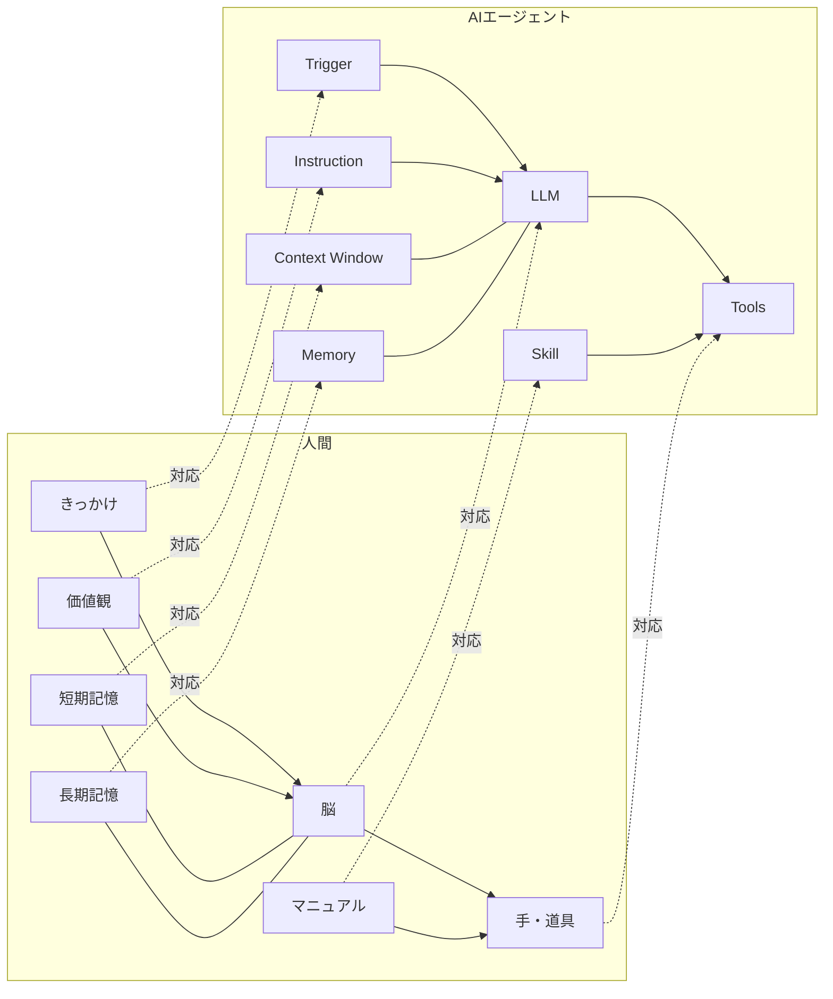

| # | 人間 | AIエージェント |
|---|------|----------------|
| (1) | 脳 | **LLM** |
| (2) | 道具・手足 | **Tools**（API／MCP／スクリプト等） |
| (3) | きっかけ | **Trigger**（時間／イベント／アクション） |
| (4) | 価値観・性格 | **Instruction** |
| (5) | 短期記憶 | **Context Window**（入出力合計トークン） |
| (6) | 長期記憶 | **Memory**（外部DB・ベクトルDB・`.md`） |
| (7) | 手順・マニュアル | **Skill**（Tool とセット） |

最小単位は **(1) LLM ＋ (2) Tools**。残りはここに重ねていくレイヤーである。

> **claudeからの補足**
> セミナーで言及された「gpt-5.5」「Hike4.5」「Gemini3.0 pro」は、それぞれ **GPT-5系 / Claude Haiku 4.5 / Gemini 3.0 Pro** を指す呼称。「クロード4.7」と「オーパス4.7」は **Claude Opus 4.7** で同一。
> 1文字＝1トークンは概算で、**英語は単語の一部、日本語はひらがな1〜2文字で1トークン**。日本語は英語比1.5〜2倍トークンを食う、と覚えておくと見積もり精度が上がる。

---

## 第2部：仕組み編

### 第3章 Agentic Loop とオーケストレーション

#### Agentic Loop の素の形

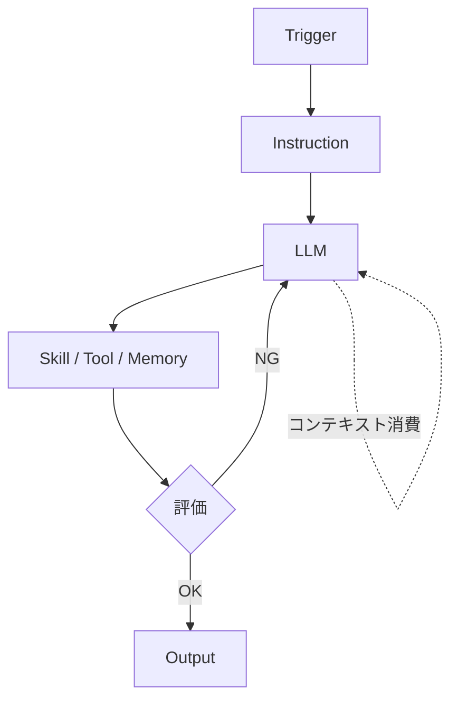

ループするほど **コンテキストウィンドウが消費される**。これが Agentic Loop の構造的弱点。

#### オーケストレーション ＝ 組織化

ツールの中に **別の Agent** を置けば、Agent 同士で役割分担できる。これを **エージェントオーケストレーション** と呼ぶ。

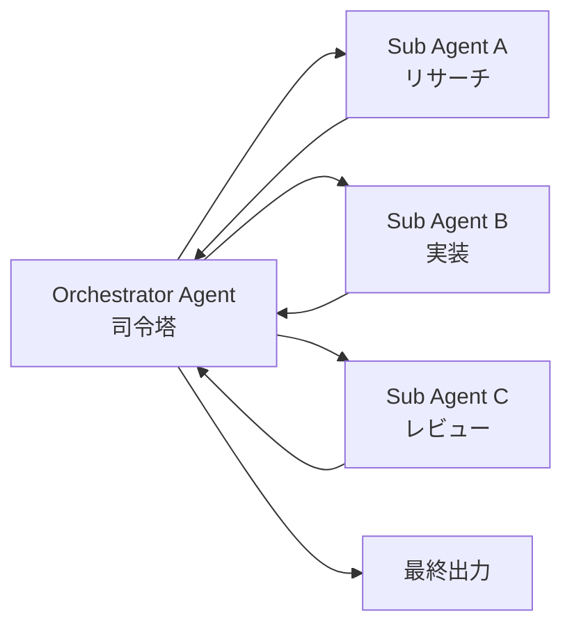

子エージェントに任せれば、親のコンテキスト消費を抑えられる。

#### ただし、オーケストレーションすればするほど精度は下がる

これは0426レポートの最重要洞察でもある。**エージェントを増やすほど引き継ぎロスが累積し、全体精度は劣化する**。だからこそ、

- 共通記憶は **RAG（外部メモリ）** に逃がす
- 改善は **Reflection Agent** で巻き取る
- いきなり5体以上を組まない（**3〜4体までが安全圏**）

> **claudeからの補足**
> ぶんたさんの実体験：
> > 「いきなり5体以上同時に作る／データがない状態で組む／一気に連携させる、はNG。3〜4体なら全然いける、それ以上は危険」
>
> 失敗モードはほぼ必ず「データがない状態で連携させる」に集約される。**先にデータ、あとからエージェント**を徹底する。

### 第4章 LLM の使い分け

#### LLM ができることは、結局3つ

> **生成・要約・発見**

これ以上でも以下でもない。タスクをこの3つに分解できれば、LLM に任せられる。

#### モデル別の役割分担

| モデル | 強み | 主な担当 |
|---|---|---|
| GPT（GPT-5系 / Codex） | クリティカルシンキング、**発見**が得意 | リサーチ計画・レビュー・品質チェック |
| Claude（Opus 4.7 / Haiku 4.5） | **実行**レイヤー、コード生成・整形 | 実装・台本整形・オーケストレーター |
| Gemini（3.0 Pro） | 安価・高速・大量さばき | 要約・分類・スクレイピング後処理 |
| Grok | **リアルタイム検索** | 最新ニュース・SNS文脈 |

#### 「Opus に集中させない」が鉄則

> **「Opus だから良い、ではない。バイト戦士をたくさん雇うほうがいい。社内全員年収1500万の会社はないでしょ？」**（ぶんたさん）

- すべてを Opus に投げると **逆に精度が下がる**（コンテキスト圧迫＋過剰推論）
- **Opus はオーケストレーター、サブは Sonnet / Haiku** が黄金比
- ぶんたさん社内では **Sonnet はあまり使わず Haiku 優先**。コスト感も含めて
- **モデル選定は人間がやる仕事**。これができる人が組織の鍵

> **claudeからの補足**
> Sonnet 4.6 はバランス型。Haiku 4.5 は超軽量・高速・安価。**99%の小タスクは Haiku で十分**で、Opus は「設計・統合・批判的レビュー」に温存する設計が、コスト／速度／精度のバランスを最大化する。

### 第5章 ツール と スキル

| 概念 | 役割 |
|---|---|
| **Tool** | できる行動そのもの（API呼び出し、ブラウザ操作、DB接続…） |
| **Skill** | Tool の「説明書」、Agent の「設計書」 |

#### Skill に書くべき3要素

1. **手順**（やり方）
2. **制約**（守らせたいルール）
3. **Shot**（参考になる入出力例）

#### Shot の効かせ方（Few-shot）

> 良い例 / 悪い例を 2〜3 個並べるだけで、フォーマット遵守率・トーン再現率が劇的に改善する。

```markdown
## 例（Shot）

### Good
入力: "顧客が解約検討中"
出力: { "intent": "retention", "urgency": "high", "next_action": "成功事例DM" }

### Bad（こうなってはいけない）
入力: "顧客が解約検討中"
出力: "頑張って引き留めてください"   ← 抽象的・実行不能
```

> **claudeからの補足**
> Claude Code の `.claude/skills/` 配下に Markdown を置くと、それがそのまま Skill になる。**典型例 1 + 失敗例 1** が費用対効果のスイートスポット。Shot を入れすぎるとコンテキストを圧迫するので注意。

#### Tool の主な種類

- **API**
- **MCP**（Model Context Protocol／道具箱）
- **スクリプト**（決定論的＝挙動が確定）
- **ブラウザ自動化**（Playwright／Selenium／Vercel系MCP）
- **データベース接続**
- **Agent**（子エージェントを Tool として呼ぶ）

---

## 第3部：記憶編

### 第6章 メモリ設計の基本

#### `memory.md` 一発勝負はいずれ破綻する

単一ファイルにすべての記憶を持たせる方式は、データ量が増えると検索精度・コンテキスト圧迫の両面で詰む。

**重要なのは「ユースケースに合う情報を持ってこれるか」**。良いメモリを引いてこれるかが、エージェントの評価を決定づける。

#### メモリの2系統

| 種類 | 形態 | 用途 |
|---|---|---|
| **構造化メモリ** | `〇〇.md` などのテキスト | ヒューマンリーダブル、ルール／前提共有 |
| **ベクトルDB** | pgvector / Pinecone / Notion裏側 | セマンティック検索、知識ベース |

> **「メモリ＝〇〇.md＋ベクトルDB」** の二刀流が標準形。

#### エンベディングの設計原則

- **エンベディングしたいデータ** と **メタデータ** は明確に分けて設計する
- ラベル・カテゴリ・タグなどメタデータは **クエリ検索（完全一致／構造化検索）** で絞り込む
- 絞り込んだ結果に対して **セマンティック検索** をかける

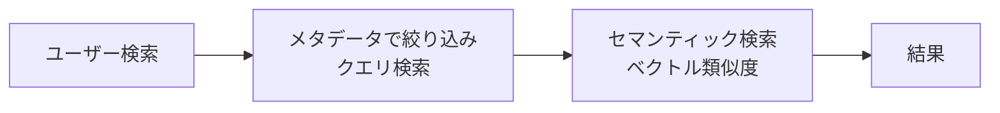

「クエリ → セマンティック」の二段構えで、**精度とコストのバランス**を取る。

### 第7章 RAG の実装

#### RAG の標準フロー

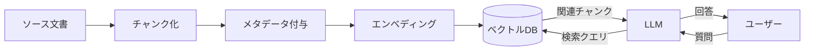

#### MCP経由の RAG（マイクロRAG）

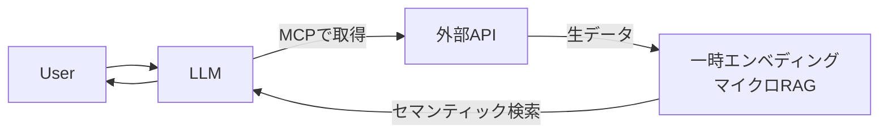

> **claudeからの補足**
> 「**マイクロRAG**」はぶんたさん社内の造語に近い実装パターン。MCP で範囲だけ大まかに取ってきて、**その瞬間にエンベディングしてベクトル空間を作り、そこに対してセマンティック検索**をかける。使い捨ての一時RAG、と理解しておけばよい。
>
> ただし MCP経由のデータ取得は **時間・トークン・費用** が三重に乗るので、定常運用するならいずれ恒久RAGに移行する。

#### NotionAPI のセマンティック検索が効かない問題

ここが0426レポートの最重要洞察。

> **「MCPは真っ暗な部屋の中で、目をつぶってこれかも違う、これかも違うってやってるようなもの」**（ぶんたさん）

- Notion API（および通常のNotion MCP）は **クエリ検索しか叩けない**
- 結果として Claude は **当てずっぽうでフィルタを試行錯誤**し、**Opus 4.7 ですら時間とトークンを溶かす**
- 回避策は **Notion カスタムエージェント**（Notion 内部で動くため、裏側のベクトル空間にアクセス可能）
- Slack / Claude Code から呼ぶときは **Open Claw（オープンクロー）** 経由で叩くと安価

> **claudeからの補足**
> 0426メモにあった「**Open Clew**」は表記ゆれで、正しくは **Open Claw**。0426レポートでは「使っても使わなくてもOK」と書いたが、**社内のベクトル検索を安く回したいなら準必須**。
> Notion カスタムエージェントを直接叩くと **1回の検索で約1000円** かかった事例があるため、安易に呼ぶのは禁止。バッチ化／キャッシュ／Open Claw 経由が前提。

#### コスト感の実例

| 項目 | コスト |
|---|---|
| Gemini Embedding API プリペイド | **1万円分** で相当使い続けられる |
| 1時間25分のセミナー動画エンベディング | **約2万円**（embedding-2 / 3072次元） |
| 同じ動画を embedding-1 で処理 | **約2000円** |
| Notion カスタムエージェント1回検索 | **約1000円** |

### 第8章 ベクトル空間とセマンティック検索

#### エンベディングモデルの選択肢

| モデル | 提供 | 特徴 |
|---|---|---|
| **Gemini Embedding 2**（`gemini-embedding-001` 系） | Google | **3072次元**標準。テキスト・画像・動画・音声を**同じベクトル空間**に並べられる |
| **`text-embedding-3-small`** | OpenAI | 軽量・安価。一般用途の第一選択 |
| **`text-embedding-3-large`** | OpenAI | 精度重視。長文・複雑文脈向け |

> **claudeからの補足**
> 0425メモの「エンベディング2」「Text エンべディング」は、それぞれ上記の **Gemini Embedding 2系** と **OpenAI text-embedding-3** を指している。Gemini Embedding 2 はマルチモーダル対応で、**動画フレーム × テキスト × 音声を同一空間に置ける**点が運用上の決め手。

#### チャンク戦略の現場知

セミナーで紹介された生々しい例。

- **パクさん（YouTube広告台本ライター）**：台本を **1行ずつチャンク** → Gemini Embedding 2 でベクトル化。「サボりでもあるが、細かければ細かいほど精度が出る肌感」
- **記事LP / キラLP**：1記事 ≒ **約160チャンク**（動画／画像／テキストブロック単位）。10記事でも1600チャンクで余裕
- **動画RAG**：1秒24フレーム → 隣接フレームの**類似度を Python で計算** → 類似度が急変したフレームを **シーン境界**として扱い、シーン単位でチャンク化。各シーンに「常識の破壊」「権威性」「ビフォーアフター」等のタグを AI で付与

> **claudeからの補足**
> 「日本語300〜800トークン／オーバーラップ50〜150トークン」は無難な出発点だが、本セミナーの主張は **「出力したい粒度から逆算して切る」**。固定トークンで切るより、**意味境界**（句点／話題の切り替わり／シーン変化）で切る方が、検索ヒット時のノイズが激減する。

#### ベクトル空間で「競合のいない需要ゾーン」を見つける

パクさんは台本ベクトル空間内で **「営業の福利」** という独自コンセプトを発見し、CTRを大きく改善した。

> **「バナーを綺麗に作るだけでは売れない。ベクトル空間内で競合と競争してないけど需要に刺さるゾーンを設計する」**（パクさん）

クリエイティブ制作 × ベクトル空間分析、という新しい使い方が生まれている。

#### Notion 裏側のエンベディング

> **「Notion DBに入れた瞬間、裏側のサーバーで勝手にエンベディング処理されている。だから`notion-search`のセマンティック検索が効く。次元数や使用モデルは非公開」**

Notion を選ぶ実利は、まさにこの **「入れた瞬間にエンベディングされる」** 仕組みにある。だから0426メモにもあった「**とにかくデータを貯めること**」が効く。

---

## 第4部：ループ編


### 第9章 Loop の 4 階層

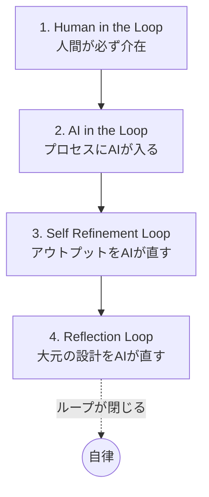

| # | 種類 | 内容 | 人間の関与 |
|---|------|------|------------|
| 1 | **Human in the Loop** | 人間が必ず介在 | 高 |
| 2 | **AI in the Loop** | プロセスに AI が組み込まれている | 中 |
| 3 | **Self Refinement Loop** | アウトプットそのものを AI が見て直す | 低 |
| 4 | **Reflection Loop** | アウトプットを生み出している **大元（プロンプト・スキル・設計）** を直す | 理想ゼロ |

> **「Reflection Loop が閉じる」 ＝ 人間が PDCA に関与しなくなる状態**

#### Self Refinement と Reflection の違い

例：ブログ記事の語尾が崩れる。

- **Self Refinement** → 出力を後から整形する後処理エージェントを足す（**対症療法**）
- **Reflection** → そもそも書き手のインストラクションに「です・ます」固定の制約を組み込む（**根治療法**）

後者のほうが再発しない。

> **claudeからの補足**
> ぶんたさんは Reflection を **「経営の顧問・組織戦略コンサル」** のメタファで説明している。
> - **オーケストレーター ＝ マネージャー**（現場の進行）
> - **Reflection Agent ＝ 外部の顧問**（戦略を直す）
>
> 「**マコラを召喚する**＝Reflection Loop が閉じる、ということ。一撃で送らないと一生倒せない」（呪術廻戦比喩）――要するに、**Reflectionは設計初期から仕込まないと後から差し込みにくい**。

### 第10章 プロンプト設計の型

| # | 名称 | 内容 | 使う場面 |
|---|---|---|---|
| 1 | **COT** (Chain of Thought) | 順序立てて考えさせる | 単純タスク |
| 2 | **TOT** (Tree of Thought) | 複数案を出して比較する | 選択を伴うタスク |
| 3 | **GOT** (Graph of Thought) | 複数視点を統合する（TOTから複数視点を作成） | 戦略的判断 |
| 4 | **Clarifying Question** | AI に逆質問させる | 要件が曖昧な時 |

#### 超重要プロンプト（Clarifying Question 強化版）

> **「あなたに足りていない情報を僕に逆質問してください。10個出してください」**

これを **PLAN フェーズの冒頭に必ず置く**。

実行直前にこれを入れるだけで、暗黙の前提が炙り出され、手戻りが激減する。

> **claudeからの補足**
> Claude／GPT どちらでも極めて有効。
> > 「これから〇〇というタスクを依頼します。実行前に、最高品質で仕上げるために**私に確認すべき質問を 5〜10 個**挙げてください。質問が出揃うまで実装は始めないでください。」
>
> Clarifying Question は **PDCA の Plan を強化する装置** と理解すると応用が効く。

#### 開発も PDCA で回す ―― **Plan が最重要**

> **PLAN（最重要） → Do → Check → Act**

ぶんたさんが繰り返し強調していたのは **「Plan Mode に入れずに走らせると秒で破綻する」**。Plan Mode は **コンテキストを消費しない**ので、納得いくまで粘ってから Accept を押す運用が正解。

### 第11章 エラー対応と Rate Limit

#### エラー対応フロー（4段）

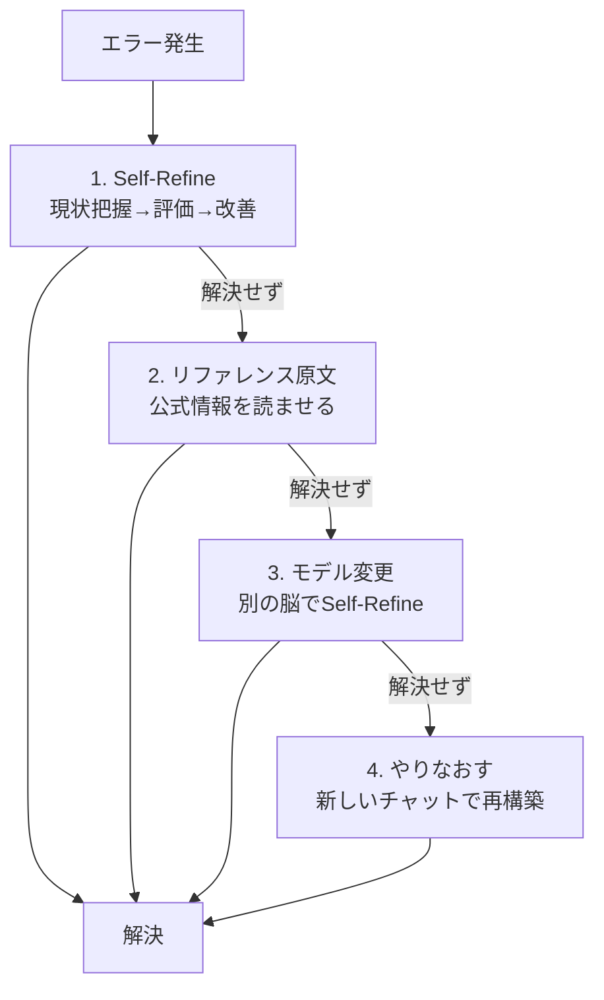

#### 「公式情報を読んできました」の罠

> **「公式情報はAIボットがアクセスできないケースが多いが、AIは"読んできました"と嘘をつく。エラーループの原因」**

Step 2（リファレンス原文）では、**実際にアクセスできているかを必ず検証**する。Context7 のような MCP 経由で**読めることが保証された経路**で渡すのが安全。

#### エラー予防

- **実装可能性チェック**（PLANで詰める）
- **リファレンス事前学習**（Context7 で公式ドキュメントを読み込ませる）
- **品質チェック**（Codex で別脳レビュー）

#### Rate Limit

> **API は「1秒3回」などの制限がある。ポーリングで解決。**

実装パターン：
```python
import time
def call_with_backoff(fn, max_retries=5):
    for i in range(max_retries):
        try:
            return fn()
        except RateLimitError:
            time.sleep(2 ** i)  # 指数バックオフ
    raise
```

---

## 第5部：組織編


### 第12章 AI 駆動型組織の作り方

#### 「部署」ではなく「機能」で分ける

伝統的な組織図は **部署（営業・マーケ・開発）** で割る。AI駆動型組織は **機能（リード獲得・ナーチャリング・受注処理）** で割る。

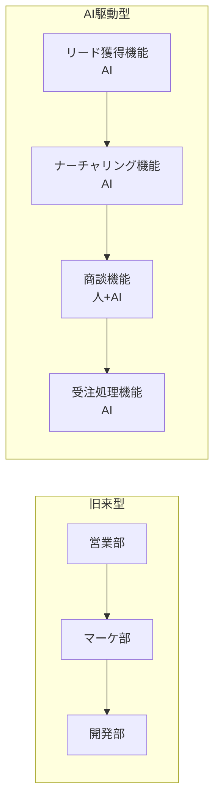

機能で割ると、**MA-SFA-CRM の横連携**がリアルタイム化する。これがAIの最大の強み。

#### 「OKR は AI が考える」

- 人間が渡すのは **KPI** だけ
- **OKR はエージェントが考える**
- さらに **Reflection Loop** で **KPI 管理すら自律化** する

#### 業務マトリックス × AI 適用順

| 頻度＼難度 | 低度 | 高度 |
|---|---|---|
| **高頻度** | **AI 一択**（営業事務・経理確定系） | 人 + AI |
| **低頻度** | いったん人 | 人（AIで補助） |

「営業事務・経理確定系は最優先で代替」がぶんたさんの一貫した主張。

#### 自動化の先に問うべきこと

> **「AI で削った先に、何を残すのか？ 浮いた時間と人材を、どこに再投資するのか？」**

これが言語化できる組織だけが、AI 時代に伸びる。

### 第13章 採用・配置・KPI 委譲

#### AI 時代の採用基準

> **「KPI だけ渡したら回せる人材＝AI 採用に向く」**

裏返すと、**OKR 管理が必要な業務はAIに代替されやすい**。

#### AIエージェントの「人材価値」概算

ぶんたさん社内の試算：

| 段階 | 月額相当の働き |
|---|---|
| 立ち上げ初日 | **約 20 万円** |
| 整え終わった後 | **100〜200 万円** |

> **「それでサボらず、忘れない」**

#### 社内浸透の鉄則

> **「データがない段階で ChatGPT / Claude を社内に渡しても、何をしていいか分からないで放置される。**
> **強制的に使わせる仕組み（Slack/ChatWork の全データ取得、メールも全部取得）を作る方が早い」**

ぶんたさん社内は実際、Slack / ChatWork / LINE WORKS / Google Meet 文字起こし / Google Drive **すべてをスレッド単位でチャンク化** → Notion DB に自動格納している。

> **「僕より会社のことを AI のほうが詳しい」**

#### 行動ログの取り方

自動スクショアプリで **1分単位でPC画面を取得** → AI解析 → ログDBへ。タスク所要時間や生産性のN1分析に使える。
**メガネ型グラスデバイスが出たら即導入予定**、というのが個人的な研究方向。

#### 個人 vs 組織

> **「個人と組織ではエージェント設計が100%変わる」**

- 個人 → 軽量・即時・属人OK
- 組織 → **業務フローをまず設計**してからエージェントに落とし込む

順番を間違えると、組織はほぼ確実に失敗する。

#### クライアント事例（生々しい数字）

- **明太子会社（福岡）**：営業事務全員の業務を奪うエージェントを開発。**精度は人間以上**だったが、現場ハレーションで **導入見送り**。「制度（解雇）が追いつかなかった」
- **流通卸**：**98%エージェント化**。「クロードコードの画面を見るだけで吐き気する」と言いながら回している。**26名→残ったのは5名、新規事業に再配置**
- **800名規模の事業を3年で**：冷静に計算した依頼を実際に受けている

#### 地方戦略 ―― ブルーオーシャン

> **「宮崎のど田舎は紙ベースで、PCすら買えない。でもオーナーが興味なくても成り立っている。遅かれ早かれ食われる」**
> **「逆に地方戦略はブルーオーシャン」**

早稲田大学と福岡で **第一次産業（農業／カキ養殖）にフィジカルAI** を入れる研究施設を立ち上げ中。

### 第14章 人間 vs AIエージェント

#### 構造的優位性

| 観点 | 人間 | AIエージェント |
|---|---|---|
| 脳 | 入れ替え不可 | **モデル切替可** |
| トリガー | 限定的（自発・依頼） | **24/365 無限発火** |
| 価値観 | 変更困難 | **インストラクション差し替え** |
| 並列実行 | 1人1タスク | **何百体でも並列** |
| 学習継承 | 退職で消失 | **データとして残る** |

> **「皆さんが触っているAIは、IQ143クラスがゴロゴロいる感覚」**

#### 人間が勝てる領域

- **コミュニケーションのきめ細かさ**
- リアルタイムでの対面（フィジカル）
- **可愛い／清潔感／健康**

> **「営業AI × 可愛い人間が一番強い」**

ぶんたさん社内では、ヘッドセット越しに **営業AIが台本を出し、人間が話す** ハイブリッドが運用中。

> **claudeからの補足**
> 「営業の福利」（パクさん発見の独自コンセプト）が刺さったのも、結局 **人間の感情に寄り添うコピー** だったから。AIが計算で見つけたゾーンを、人間の声で伝える、という分業が現状最強。

#### コミュニケーションへの投資先

> **「美容と健康に投資しろ。筋トレ、肌、清潔感」**
> **「マーケで負けたら寿司職人になれ。寿司はまだ AI に勝てない」**

ヒューマノイドの実用化までの予測：**5〜10年**。それまでは **美容・健康・コミュニケーション** が人間の主戦場。

---

## 第6部：実装編

### 第15章 Claude Code 5段パイプライン

ぶんたさん社内で実際に回している、**トークン消費を 70〜78% 削減**したパイプライン。

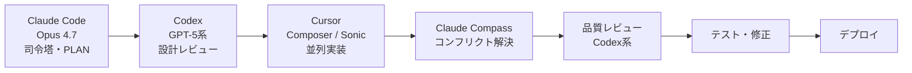

| # | 役割 | 担当 | 目的 |
|---|------|------|------|
| 1 | 司令塔・プランニング | **Claude Code（Opus 4.7）** | 全体設計、PLAN |
| 2 | 設計レビュー | **Codex（GPT-5系）** | クリティカルシンキング |
| 3 | 並列実装 | **Cursor Composer / Sonic** | サブエージェント並列発火 |
| 4 | コンフリクト解決 | **Claude Compass** | マージ衝突を捌く |
| 5 | 品質レビュー | **Codex系レビュースキル** | 最終品質ゲート |

> **Cursor は20ドルプランで「ゴリゴリ使える」**。Composer をサブエージェントとして大量並列発火させるのがコツ。

> **claudeからの補足**
> Claude Code 単体でも `Agent` ツール × 並列発火で同様の構造は組める。ただし **「実装は Cursor、設計は Claude Code」** のような **得意領域での役割分担**が、コスト最適化の本丸。

### 第16章 開発環境・CLI・MCP

#### 入れておくべき CLI

| カテゴリ | CLI |
|---|---|
| バージョン管理・コラボ | **GitHub** |
| クラウド | **Google Cloud / AWS / Vercel / Supabase** |
| Office 系 | **GWS（Google Workspace）／clasp（GAS）** |

「**CLI は入れておけ**」が0426メモの強い主張。エージェントは GUI より CLI を扱うほうが圧倒的に得意。

#### MCP の世界

> **自然言語 → LLM → MCP → API → 実行対象**

#### 野良 MCP は危険

`MCP.so` のような配布サイトもあるが、**信頼できる発行元かを必ず確認**する。Notion / Gmail / Google Drive / Calendar / Supabase などは公式 or 準公式 MCP がある。

#### ぶんたさん社内で使っている主な MCP

- **DPro MCP**（動画広告分析Pro）――社内分析の主役
- **Notion MCP**（クエリ検索のみ／セマンティック検索は別経路）
- **Open Claw**（Notion カスタムエージェント呼び出し用、安価経路）
- **YouTube公式 MCP**

> **claudeからの補足**
> 0426メモにあった「**Cloud Vision OCI**」は **Computer Use**（画面を見て操作する Vision 系エージェント機能）の表記ゆれ。Claude の `computer-use`、Codex の Computer Use 系を指す。

#### Context7

> **「○○について教えて。 use context7」** だけで、最新の公式ドキュメントを読み込んでくれる MCP。

LLM の学習データは古くなるため、**ライブラリ・SDK・API のドキュメントは Context7 経由で読ませる**のが事故防止の鉄則。

### 第17章 2日間ワークショップで何をやったか

#### Day 1：Self-Refinement Loop を仕込む

各自の業務に対して **生成 → チェック → 改善** を意図的に組み込んだエージェントを構築。

冒頭で全員に叩き込まれたプロンプト：

> **「あなたに足りていない情報を僕に逆質問してください。10個出してください」**

#### Day 2：RAG を作る

**最終課題は RAG の構築**。経路は2つ。

1. **Notion DB**（裏側自動エンベディング）に放り込む
2. **Supabase + `text-embedding-3`** で本格構築

参加者全員が **DPro MCP** を Claude Desktop の「カスタムコネクター追加」から接続。岡田さん作の **整理券システム**（質問待ち行列）も配布。

#### 印象的な事故事例（実装の教訓）

##### 150万円誤発注事件

パクさんが「予算1万2000円」と指示するつもりで言葉が崩れ、Claude が **1万2000ドル ＝ 約150万円** で広告予算を上げた事件。

> **原因：「マーケター」というインストラクションが、慎重さよりクリエイティビティを優先するよう設計されていたため、ダブルチェックが飛ばされた。**

##### 「私はAIです」と自白する事故

LINE ナーチャリング自動化エージェントが「えこ」というキャラを演じている最中、確率的に **「私はAIです」とゲロった**。チェックエージェントを置いて回避。

#### 教訓

- **重要制約は二重化**（Instruction だけでなく Skill にも、評価ステップにも）
- **金額・通貨・固有名詞**は必ず Plan 段階で確認させる
- **キャラ憑依系は必ずチェックエージェントを噛ませる**

> **claudeからの補足**
> 「マーケター」のような **役割プロンプトには性格特性が紐づく**ため、慎重さが要る場面では「**慎重なマーケター**」「**ダブルチェックを必ずするマーケター**」のように、性格まで指定するのが安全。
> あるいは Reflection 側で「金額が10万円超なら必ず人間承認」のような **ハードガード** を入れておく。

---

## エピローグ：Loop を閉じる

最終ゴールは、**Loop を閉じること**。

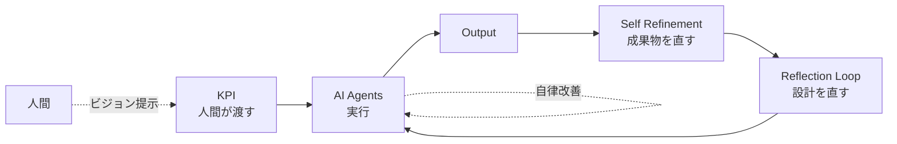

- 入力 → 処理 → 出力 → 評価 → 入力、のループを **自律で回す**
- **Reflection Agent** を置き、KPI を渡すだけで AI が改善まで回す状態を目指す
- 人間は **ループの「外」** で、**意思決定とビジョン提示**に集中する

これが本セミナーが描いた到達点。

> **「3か月後に、自分をクビにできるくらい AI を動かせ」**

ぶんたさんの言葉に乗せて、本書を閉じる。

---

## 付録 A：実装チェックリスト

### A-1. エージェント設計時のチェック

- [ ] そのエージェントの **役割（ロール）** を一文で言えるか
- [ ] **インストラクション 5 要素**（役割／目的／背景／制約／参考情報）が揃っているか
- [ ] **スキル**に「手順・制約・Shot」が入っているか
- [ ] 仕事を **Opus に集中させていないか**（適材適所のモデル分担）
- [ ] **コンテキストウィンドウを食い潰さない**ように、子エージェントへ責務分割しているか
- [ ] **3〜4体以上に増やしていないか**（増やすときは RAG / Reflection をセットで）
- [ ] **重要制約は二重化**（Instruction × Skill × 評価ステップ）

### A-2. RAG を作るときの最低ライン

- [ ] データソースを定義した（Notion / Drive / 動画 / 台本 etc.）
- [ ] チャンク戦略を **意味境界**で決めた（サイズ・オーバーラップ・分割単位）
- [ ] 構造化メタデータ（日付・著者・カテゴリ）を付与した
- [ ] エンベディングモデルを選定した（Gemini Embedding 2 / OpenAI text-embedding-3）
- [ ] ベクトル DB を選んだ（Notion 自動 / Supabase pgvector / Pinecone）
- [ ] **クエリ × セマンティック検索** のハイブリッド検索を実装した
- [ ] エージェントの実行ログを保存している（Reflection Loop の燃料）
- [ ] **Notion から取るならカスタムエージェント or Open Claw 経由**を検討した

### A-3. ループ運用のチェック

- [ ] Human in the Loop が **どこに残っているか** を明文化したか
- [ ] Self Refinement と Reflection を **混同していないか**（成果物を直すのか、設計を直すのか）
- [ ] 精度が落ちたときに **エージェントを分割** する判断軸があるか
- [ ] **Plan Mode に入れずに走らせていないか**（コンテキスト消費なしで粘れる）
- [ ] **Clarifying Question** を Plan の冒頭に置いているか

### A-4. 組織導入のチェック

- [ ] **業務フロー** をまず可視化したか（エージェントは後）
- [ ] **データを貯める仕組み** を先に作ったか（Slack / Drive / Meet 全データ取得）
- [ ] **KPI だけ渡せば回る業務**から AI 化しているか
- [ ] 自動化で浮いたリソースの **再投資先** を言語化したか
- [ ] Human in the Loop を **どこに残すか** が決まっているか

---

## 付録 B：用語集

| 用語 | 意味 |
|---|---|
| **Agentic Loop** | エージェントが Trigger → Instruction → LLM → Tool → 評価 のループで動く構造 |
| **Reflection Loop** | 出力ではなく **設計（プロンプト・スキル）** を AI が直すループ |
| **Self Refinement Loop** | 出力そのものを AI が直すループ |
| **MCP** | Model Context Protocol。LLM と外部ツールを繋ぐ標準プロトコル |
| **Computer Use** | 画面を見て操作する Vision 系エージェント機能（≠ OCR） |
| **Open Claw** | Notion カスタムエージェントを安価に呼び出す経路 |
| **DPro MCP** | 動画広告分析Pro が提供する MCP |
| **Gemini Embedding 2** | Google の `gemini-embedding-001` 系。3072次元・マルチモーダル |
| **text-embedding-3** | OpenAI のテキスト埋め込みモデル（small / large） |
| **マイクロRAG** | MCP で取得 → その場でエンベディング → 即検索する使い捨てRAG |
| **Plan Mode** | Claude Code で計画段階を粘る機能。コンテキストを消費しない |
| **Clarifying Question** | AI に逆質問させて、暗黙の前提を炙り出すプロンプト技法 |
| **COT / TOT / GOT** | Chain / Tree / Graph of Thought。プロンプト思考型 |
| **Few-shot / Shot** | 入出力例を見せて精度を上げるプロンプト手法 |
| **UPSIDER** | 法人カードSaaS。エージェントに与えるクレカとしての用途 |
| **Seedance** | ByteDance の動画生成モデル（画像→動画→広告へ） |

---

## 付録 C：名言集

> 1. **「自分をクビにできるくらい AI を動かせ」**
> 2. **「AI ＝ 言葉 × 設計。うまくいかないときは、必ずどちらかが破綻している」**
> 3. **「Opus だから良い、ではない。バイト戦士をたくさん雇うほうがいい。社内全員年収1500万の会社はないでしょ？」**
> 4. **「Opus 4.7 に裏側のラックの情報を取らせたら、一回で千円かかった。高いやつを使えばいいわけじゃない」**
> 5. **「MCP は真っ暗な部屋の中で、目をつぶってこれかも違う、これかも違うってやってるようなもの」**
> 6. **「僕より会社のことを AI のほうが詳しい状態を作れ」**
> 7. **「マコラを召喚する＝Reflection Loop が閉じる、ということ。一撃で送らないと一生倒せない」**
> 8. **「営業の福利」**――パクさんがベクトル空間内で発見した競合不在のオンリーワンコンセプト
> 9. **「バナーを綺麗に作るだけでは売れない。ベクトル空間内で競合と競争してないけど需要に刺さるゾーンを設計する」**
> 10. **「地方は紙のままで成り立っているけど、遅かれ早かれ食われる。逆に言うと、そこを開拓するのが狙い目」**
> 11. **「マーケで負けたら寿司職人になれ。寿司はまだAIに勝てない」**
> 12. **「3か月後に自分をクビにできなかったら、皆さんクビ」**

---

## 出典

- 0425 セミナーレポート（`0425レポート.md`）
- 0426 学習レポート（`0426レポート.md`）
- 録音文字起こし 8 本（`録音文字起こし/`）
  - AIエージェントと人間の能力比較
  - AIエージェントのアジェンティックループとオーケストレーション
  - AIエージェント開発と自動化実装の2日間ワークショップ
  - AIエージェント開発のプラン設計とClaudeコード実装ワークショップ
  - AIエージェント構築におけるメモリ管理とベクトル埋め込み技術
  - AI駆動型組織の構築と人材採用戦略
  - ベクトルデータベースとAIエージェント構築の実装検討
  - ベクトルデータベースと生成AIを活用したデータ検索・管理戦略
- 図解：Gemini API（Imagen 4 / Mermaid）

---

*編纂：2026-04-27 / Claude Code Deep DIVE プロジェクト*
